# How to Setup Wazuh Retention Policy

There are two ways to implement the retention policy:

* Using the Visual Editor
* Using the JSON Editor

In this guidelines, we will go step by step to setup the retention policy by using the `JSON Editor`.

1. Click on the `upper left menu ☰`, go to `Indexer management`, and choose `Index Management`. Choose `State management policies` and click `Create policy`. Select `JSON editor` and click `Continue`.


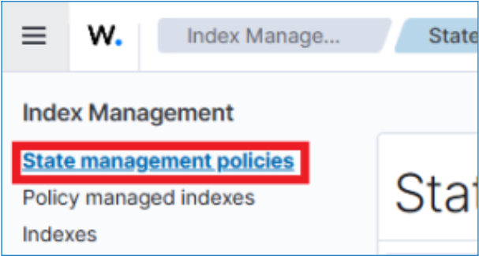

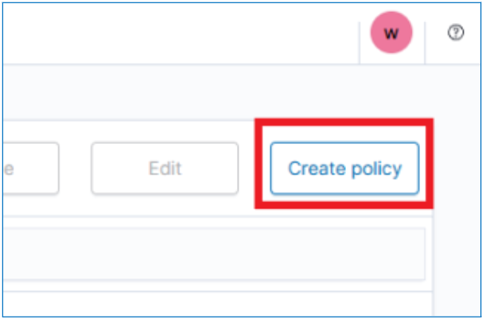

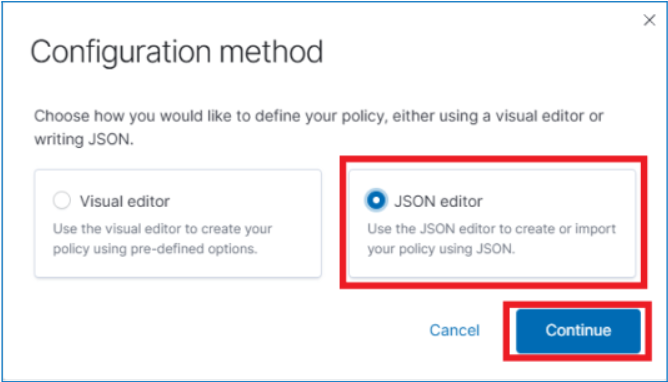

2. Enter a unique `Policy ID` in the Policy info section. For example, `wazuh-alert-retention-policy`. You can optionally enter a `description` within your JSON policy definition.

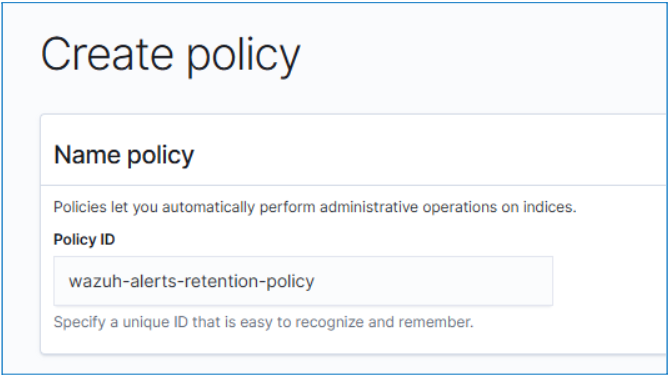

3. In the `Define policy` section, `replace` the content with your `JSON policy definition`. Below is one of the example of wazuh retention policy for 90 days.


```
{ 
    "policy": { 
        "policy_id": "wazuh-alert-retention-policy", 
        "description": "Wazuh alerts retention policy delete logs after 90 days", 
        "schema_version": 17, 
        "error_notification": null, 
        "default_state": "retention_state", 
        "states": [ 
            { 
                "name": "retention_state", 
                "actions": [], 
                "transitions": [ 
                    { 
                        "state_name": "delete_alerts", 
                        "conditions": { 
                            "min_index_age": "90d" 
                        } 
                    } 
                ] 
            }, 
            { 
                "name": "delete_alerts", 
                "actions": [ 
                    { 
                        "retry": { 
                            "count": 3, 
                            "backoff": "exponential", 
                            "delay": "1m" 
                        }, 
                        "delete": {} 
                    } 
                ], 
                "transitions": [] 
            } 
        ], 
        "ism_template": [ 
            { 
                "index_patterns": [ 
                    "wazuh-alerts-*" 
                ], 
                "priority": 1 
            } 
        ] 
    } 
}
```

** Adjust the `“min_index_age”:` from `“90d”` to your preferred number of days for `minimum index retention`.

4. Then, click `Create`.

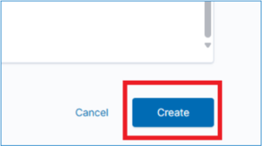

# Applying the Retention Policy to Alerts Index

1. Click on the `upper left menu ☰`, go to `Indexer management`, and choose `Index Management`. Choose `Indexes`.

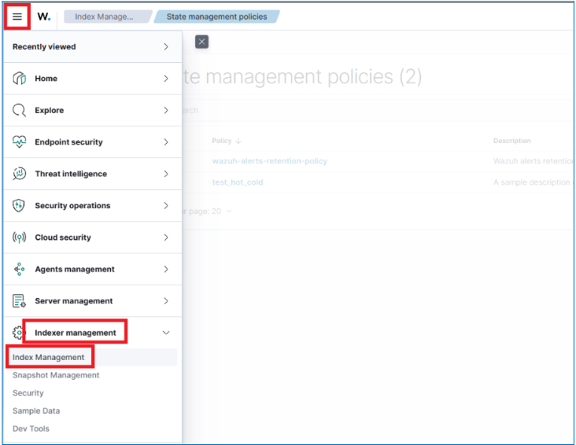

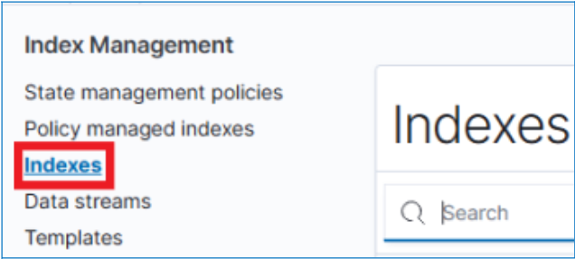

2. Search for the `wazuh-alerts` indexes and select all of it.

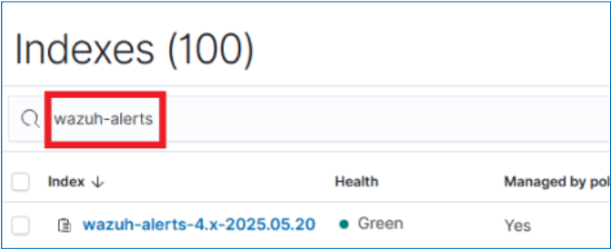

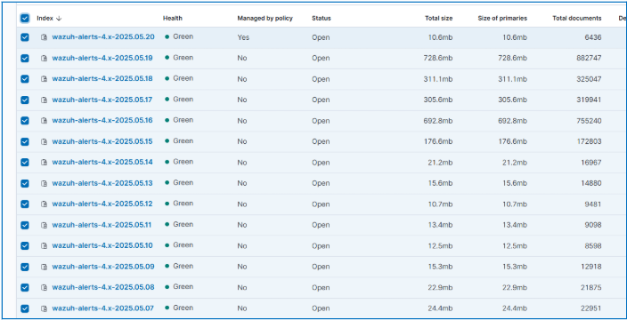

3. Click `Actions` > `Apply policy`.


4. Choose the policy that we have created.

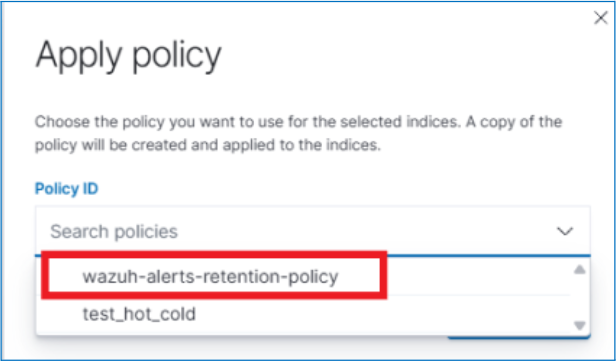

5. Then, click `Apply`.

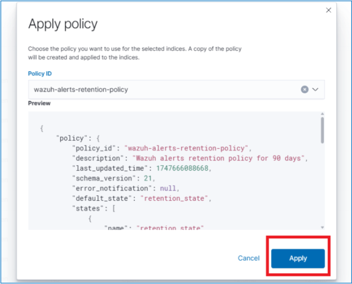

### We have successfully setup Wazuh Retention Policy 